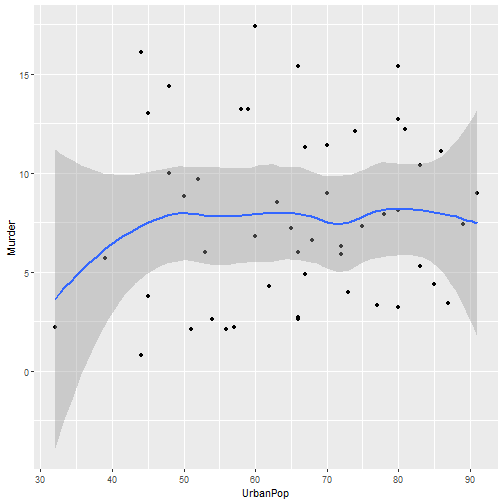

Developing Data Products (Course Project)
========================================================
author: Rishi Dinesh
date: 09/06/2020
autosize: true

Introduction
========================================================
This Shiny App uses the `USArrests` datasets that is part of the R datasets Package.
It is a simple app that summarises and plots the various crime types in the US grouped by 
State. A preview of the dataset is shown below : 

```r
head(USArrests)
```

```
           Murder Assault UrbanPop Rape
Alabama      13.2     236       58 21.2
Alaska       10.0     263       48 44.5
Arizona       8.1     294       80 31.0
Arkansas      8.8     190       50 19.5
California    9.0     276       91 40.6
Colorado      7.9     204       78 38.7
```

Components of the app
========================================================
The app has a sidebar layout. The sidebar panel allows the user to select a crime type from a list of three options.
The main panel of the app is divided into three tabs:
- Heatmap : plots the heatmap for the given crime typr
- Table : displays a table showing the crime rates for that particular crime type in each state
- Summary : provides a summary of the above mentioned table along with a crime type vs urban population   scatterplot with a fitted regression line.

How it works
========================================================
A heatmap is plotted using the gvisGeochart function of the googleVis library. The colour variation in the heatmap is determined by the user's input. Assume the input is "Murder". The scatterplot is plotted using the qplot function from the ggplot2 library.(Output in next slide)

```r
library(ggplot2)
qplot(UrbanPop,Murder,data=USArrests,geom=c("point","smooth"))
```
Link to the app : https://rishidinesh.shinyapps.io/myApp/

Link to the github repo : https://github.com/RishiDinesh/Developing-Data-Products


Sample Output
========================================================



